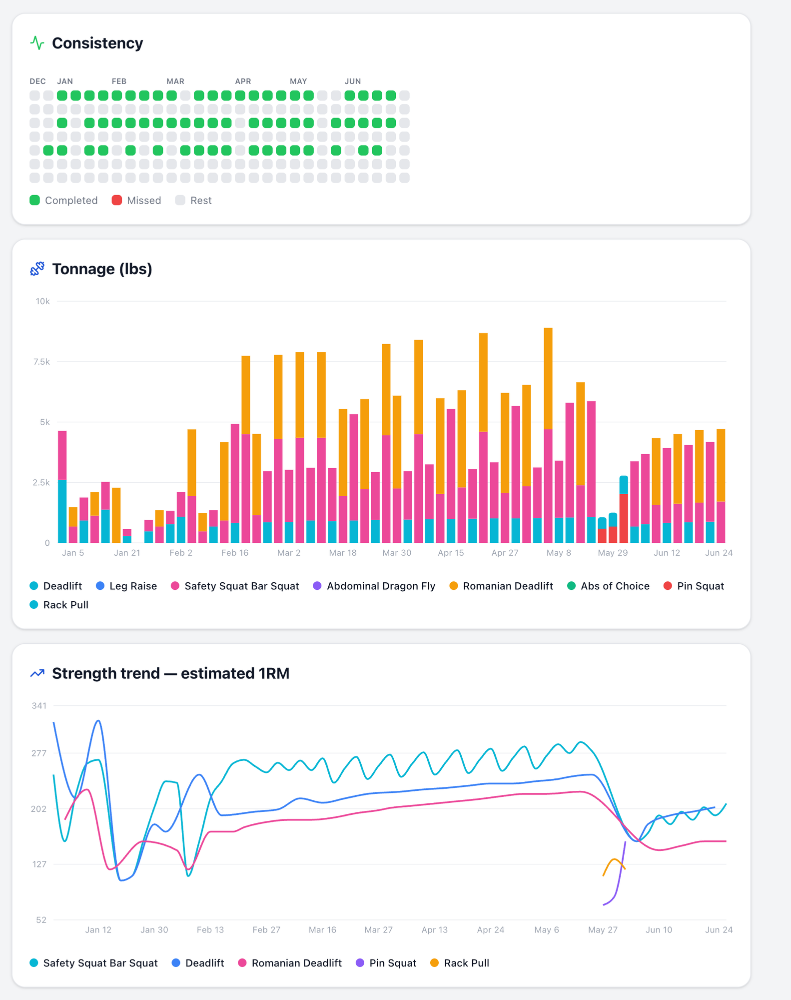
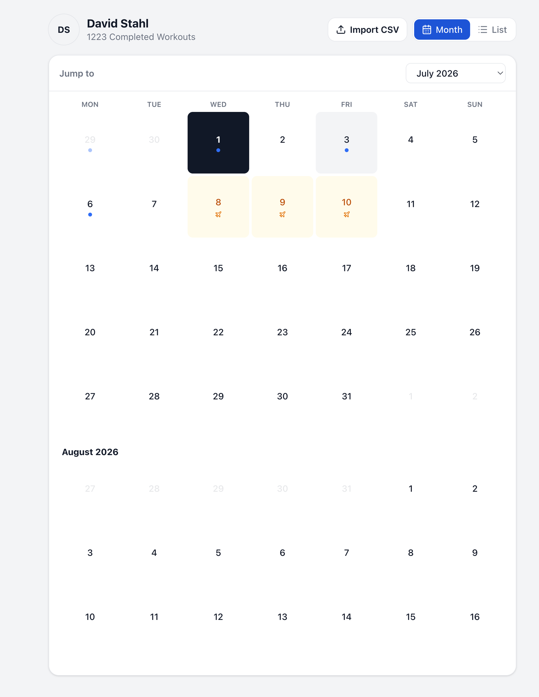
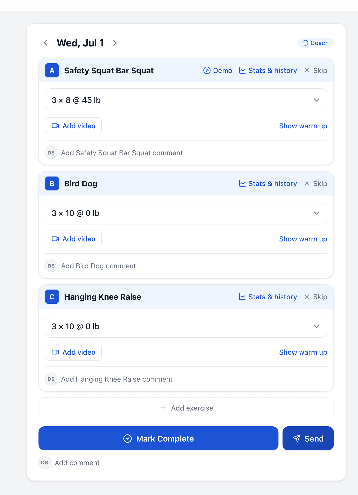
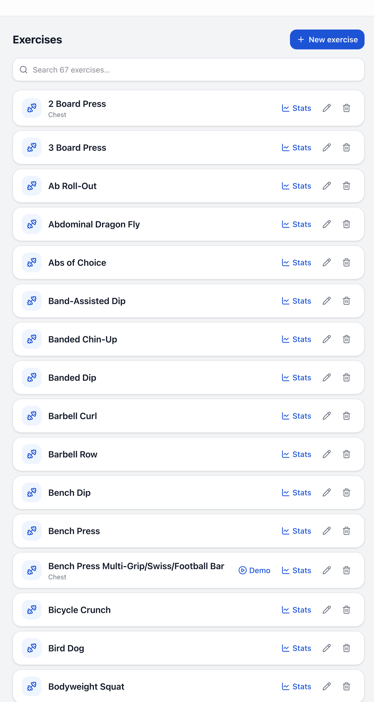

<div align="center">

# 🏋️ StrongCoach

### A self-hosted strength-training app with an AI coach that programs for you and holds you accountable.

Plan and log your lifts set-by-set, track PRs, estimated 1RMs, tonnage and
consistency over time — and train alongside an AI coach that knows your history,
respects your injuries, and emails you when you skip a session.


</div>

---

## 🤖 Meet Hank — your AI coach

Chat with a Starting-Strength coach that has your full training history in
context. He remembers your injuries and weight caps, adapts programming around
them, schedules your sessions, and won't let you push into a bad idea.

<div align="center">
  
</div>

> In the conversation above, Hank hears about a back spasm, refuses to load the
> spine, and programs a light rehab week — then asks the athlete to check back
> mid-week. He can write those sessions straight onto the calendar.

---

## 📊 Dashboard & progress

Consistency heatmap, stacked tonnage-by-exercise, and an estimated-1RM strength
trend — all range-filterable (30d → all time).

<div align="center">
  
</div>

---

## 🗓️ Calendar & workout logging

A scrollable **month view** (infinite scroll + month/year jump) and a **list
view**, with completion dots, coach-programmed badges, and ✈️ travel blackouts.
Tap a day to log it set-by-set.

<table>
  <tr>
    <td width="50%"></td>
    <td width="50%"></td>
  </tr>
  <tr>
    <td align="center"><em>Month calendar — completion dots + travel days</em></td>
    <td align="center"><em>Day view — per-set logging, warm-ups, comments</em></td>
  </tr>
</table>

---

## 💪 Exercise library

A searchable catalog with demo videos, per-exercise stats & history, and full
create / edit / delete (delete is guarded when an exercise has history).

<div align="center">
  
</div>

---

## ✨ Features

- **AI Coach ("Hank")** — chats with your full history in context; **remembers**
  facts about you (injuries, caps, goals). Runs on **Claude via Portkey**. He can:
  - **schedule & adjust** workouts from chat, respecting your weight caps and excluded lifts,
  - **autonomously program** upcoming Starting-Strength sessions, progressed from your real lifts,
  - honor **blackout days** (travel) — never programs or nags on them,
  - send a **morning digest** + **missed-workout reminders** by email (Resend) on a daily cron.
- **Calendar** — infinite-scroll month view + list view with completion dots and travel markers.
- **Workout logging** — exercise cards (A / B / C…), `N × reps @ weight`, expandable per-set
  logging, warm-up calculator, demo links, comments, skip, and **Mark Complete**.
- **PRs & Estimated 1RMs** — auto-computed per workout (Epley formula).
- **Stats & history** — per exercise: working-weight, e1RM and PR lines with 30d…all ranges.
- **Dashboard** — consistency heatmap, tonnage-by-exercise, strength-trend charts.
- **CSV import** — bring in workout-history exports; completed sessions without per-set actuals
  fall back to the prescription so they still feed PRs and charts.
- **Multi-user + admin** — email/password auth, per-user data isolation, an admin area to
  create users and manage roles, and a **separate coach per user**.

## 👥 Multi-user & admin

Every user sees only their own workouts and gets their **own** coach (cloned from
a shared "Hank" template — personas can diverge). Admins get an `/admin` area to
create users, set roles (admin / user), reset passwords, and edit any user's
coach. Auth is a lightweight custom email + password with database sessions — no
external service, so it runs fully self-hosted.

## 🛠️ Tech stack

- **Next.js 16** — App Router, React 19, Server Components + Server Actions
- **Tailwind CSS v4** · **Recharts** · **lucide-react** · **date-fns**
- **Drizzle ORM** on **Postgres** via the standard `node-postgres` driver — runs
  against any Postgres (local Docker, self-hosted, managed)
- **Claude via Portkey** for the coach · **Resend** for email · **node-cron** for the daily tick
- **bcryptjs** + DB sessions for auth

## 🚀 Getting started

> **Requires Node ≥ 20.9** (pinned to `22.14.0` via `.nvmrc` — run `nvm use`) and
> **Docker** for the database.

```bash
npm install

# 1) Start Postgres (see docker-compose.yml)
docker compose up -d

# 2) Configure env (copy the template, then fill in keys)
cp .env.example .env.local

# 3) Push the schema + seed demo history, then create your admin account
npm run db:push
npm run db:seed
npm run db:create-admin -- you@example.com 'your-password' 'Your Name'

# 4) Run it
npm run dev          # http://localhost:3000
```

`DATABASE_URL` in `.env.local` is the only thing to change to point at a
different Postgres. The AI coach needs `PORTKEY_API_KEY` + `PORTKEY_INTEGRATION`;
email reminders need `RESEND_API_KEY` + `COACH_FROM_EMAIL` (all optional — the
app runs without them, the coach features just stay dormant).

## 📜 Scripts

| Script | What it does |
| --- | --- |
| `npm run dev` | Start the dev server |
| `npm run build` | Production build + typecheck |
| `npm run db:push` | Sync the Drizzle schema to Postgres |
| `npm run db:seed` | Wipe + reseed demo training history |
| `npm run db:create-admin -- <email> <pw> [name]` | Create an admin and assign existing data |
| `npm run import -- <csv> [--append] [--user=<id>]` | Import a workout-history CSV |
| `npm run db:studio` | Open Drizzle Studio |

## 🗄️ Data model

`users` own everything. `exercises` is a shared catalog; `workouts` →
`workout_exercises` → `set_groups` (prescriptions) and `logged_sets` (actual
performance). PRs, e1RM, tonnage and the charts are all derived from
`logged_sets`. The coach adds `coach_profile`, `coach_memories`, `chat_messages`,
`blackout_days`, and `coach_events`. See [`src/db/schema.ts`](src/db/schema.ts).

## 📝 Notes

- Deploys as a **Docker container** with a Postgres container alongside it.
- The coach explicitly respects stated injury limits and defers pain to a
  professional — it is not medical advice.

<div align="center">
<sub>Built with <a href="https://claude.com/claude-code">Claude Code</a>.</sub>
</div>
